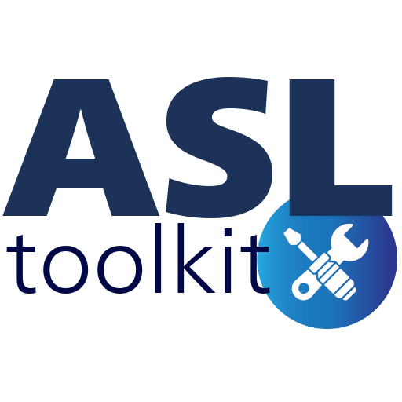

# ASLtk - Arterial Spin Labeling toolkit

{ width="350" .center}
Welcome to the ASL toolkit!

This 3D Slicer extension was designed to assist users in processing Arterial Spin Labeling (ASL) MRI images, from basic imaging protocols to the state-of-the-art models provided in the scientific literature.

The major objective of this project is to give an open-source alternative to researchers in the MRI field.

The full documentation of the usage, implementation and updates in the `asltk` library is given in this repository and posted online using a [web-based host](https://asltk.readthedocs.io/en/main/). 

## Output examples

The ASLtoolkit extension is a simple way to collect ASL quantitatve output mappings using a GUI interface. The images below represents some examples:

{ width="300" .center}
A CBF map example, using multi PLD ASL imaging acquisition

{ width="300" .center}
A ATT map example, using multi PLD ASL imaging acquisition

{ width="300" .center}
A T1 blood-GM map example, using the Multi TE ASL imaging acquisition

## Modules

### CBF ATT

This module is able to reconstruct the `CBF` and `ATT` maps from a ASL imaging acquisition.

### Multi TE ASL

This module is able to reconstruct the `T1 blood-GM` map from a multi echos (TE) ASL imaging acquisition.

## How to use

The `ASLtoolkit` extension can be used directly from the modules in the 3D Slicer module list. Hence, the user can select the required information and also start the mapping calculation. When it is finished, the data is loaded in the Slicer scene viewer.

## Cite this tool

We hope that the `ASLtoolkit` can be helpful for your applications. If possible, recall to cite at least one of the following publications:

* Senra Filho, A. C. ; Paschoal, A. M. "Open-Source Multi-Echo (TE) MRI Tool for Arterial Spin Labelling Imaging Protocols". ISMRM & ISMRT Annual Meeting (2025)

## License

This project is under MIT license and following details are given at the [LICENSE](https://github.com/LOAMRI/Slicer-ASLtoolkit/blob/main/LICENSE) file in the project repository.